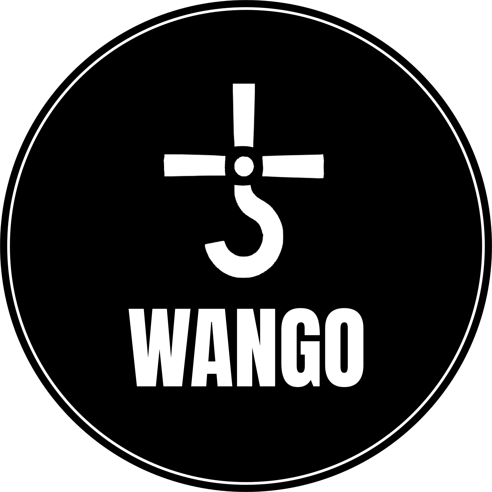

    <h1>Wango-Game-Engine</h1>
    

<h2>Table of Content</h2>
<ol>
    <li><a href="#subject1">About</a></li>
    <li><a href="#subject2">Technology Stack</a></li>
    <li><a href="#subject3">Project Structure</a></li>
    <li><a href="#subject4">Getting Started</a></li>
    <li><a href="#subject5">Contribution</a></li>
    <li><a href="#subject6">Testing</a></li>
</ol>

<h1 id="subject1">About </h1>

Wango is an easy-to-use 2D game engine designed for the Go programming language. Its primary focus is on enabling the rapid development of 2D games with Go, making it an ideal tool for quick iteration and creativity during GameJams.

<h1 id="subject2">Technology Stack</h1>

<h1 id="subject3">Project Structure</h1>

<h1 id="subject4">Getting Started</h1>

<h1 id="subject5">Contribution</h1>

<h1 id="subject6">Testing</h1>

